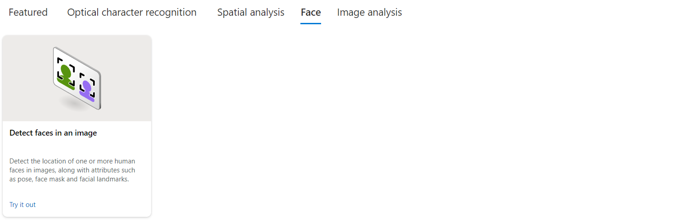
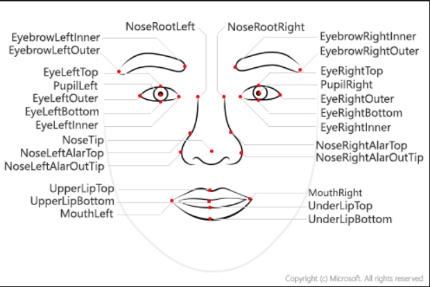

# Reconhecimento Facial

Através do bootcamp, foi iniciado os estudos sobre visão computacional através da Azure AI, experimentando alguns usos free-code da plataforma, além de ver seus resultados.

Aproveitando também o uso compartilhado do mesmo recurso na plataforma, foi utilizado também um serviço para extrair texto de imagens.

Os resultados observados foram o esperado de acordo com o que o artigo propunha, os rostos observados na imagem foram reconhecidos pela máquina e depois destacados no output. Na pasta de mesmo nome se encontram também arquivos JSON catalogando as coordenadas dos identificadores.

## Principios por trás do reconhecimento facial

Fiquei curioso em saber mais da ferramenta que acabara de utilizar, então consultei a documentação para ter uma noção maior do processo de identificação.

Todo rosto detectado corresponde a um <i>faceRectangle</i>, uma resposta do sistema com coordenadas paraa eixo de esquerda, topo, largura e altura, com essas coordenadas a aplicação retorna a posição do rosto destacado.

De acordo com a imagem acima, o rosto humano possui 27 traços rastreáveis fáceis de se localizar pela máquina. Atualmente, o modelo de detecção Detection_03 é atualmente o mais preciso modelo de identificação facial, utilizando somente do olho e púpila.

# Optical Character Recognition

Através dessa função, foi possível realizar a extração de texto em imagens e obter o texto de forma ordenada em nível de relevância para o modelo.

As imagens utilizadas e os resultados obtidos se encontram nas pastas neste repositório.